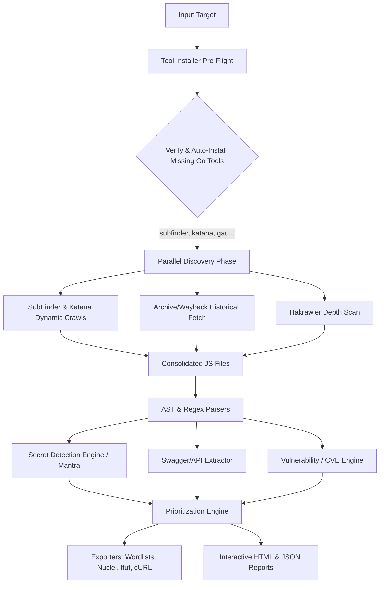

# JSEye v3.0 - Ultimate JavaScript Intelligence & Attack Surface Discovery Engine


<div align="center">
  
  
  
</div>

JSEye is an enterprise-grade, fully automated attack surface discovery and JavaScript analysis engine designed for elite bug bounty hunters and red teamers. 

Going far beyond simple regex crawling, JSEye silently orchestrates a high-performance, 6-tool Go pipeline (`gau`, `waybackurls`, `hakrawler`, `subfinder`, `katana`, `mantra`) combined with headless browser rendering and **Abstract Syntax Tree (AST)**-level parsing. It automatically extracts hidden endpoints, hardcoded credentials, obsolete library CVEs, and Swagger/OpenAPI specifications from deeply obfuscated and minified JavaScript.

---

## ⚡ Zero-Touch Automated Setup

Forget manually configuring binary paths and installing dependencies. **JSEye handles its own environment.**

On your first run, JSEye performs a pre-flight check across Linux, Windows, and macOS. If any required external OS tools are missing, it natively compiles and installs them via Go before the scan even begins.

### Installation

JSEye natively bundles its requirements into a clean `pip` package. Install globally in seconds:

```bash
pip install jseye
```

*Required: Python 3.8+. Go is recommended for the initial transparent tool installation pipeline.*

---

## 🧠 Core Capabilities

- **Zero-Touch Tool Orchestration**: Installs and multiplexes `subfinder`, `katana`, `gau`, `waybackurls`, `hakrawler`, and `mantra` asynchronously.
- **Deep JS AST Analysis**: Employs headless browser rendering and AST decomposition to extract dynamically loaded parameters and endpoints that defeat standard static regex parsing.
- **Swagger / OpenAPI Mapping**: Scans over 200+ known endpoints and dynamically parses OpenAPI/Swagger specifications (v2/v3), yielding fully qualified API routes directly from the target infrastructure.
- **Vulnerability & CVE Mapping**: Identifies obsolete library versions mapping them dynamically to CVSS/CVE databases (NVD/OSV).
- **Intelligent Noise Filtering**: Context-aware prioritization engine filters out "dead" frameworks and focuses only on high-value, actionable assets.
- **Advanced Export Engineering**: Generates immediate tactical outputs: ffuf brute-force configurations, cURL pipelines, Burp Suite XML sitemaps, and custom Nuclei templates.
- **Interactive Reporting**: Generates sleek, filterable JSON and HTML reports, including an Executive Summary for compliance tracking.

---

## 🏗️ Deep Architecture Pipeline

JSEye executes in an 8-phase parallelized pipeline to maximize speed and coverage.




---

## 🎯 Advanced Usage & Scenarios

JSEye works seamlessly against a single host, an entire CIDR, or a local file folder of previously scraped assets.

### Basic Reconnaissance
Execute a highly optimized scan with smart defaults (ideal for initial recon):
```bash
jseye target.com
```

### Ultimate Hunter Mode (`--all`)
Enable every specialized crawler, headless browser rendering, exhaustive API finding, AST parsing, and automatically generate all export formats (Nuclei, ffuf, etc.) in one command:
```bash
jseye target.com --all
```

### Actionable & Aggressive Filtering
Focus only on high-fidelity, exploitable findings (removes 95% of standard framework noise):
```bash
jseye target.com --actionable --aggressive-filter
```

### Continuous Attack Surface Monitoring (CI/CD)
Compare a fresh scan against a baseline report to spot newly added endpoints, APIs, or leaked secrets in real-time. Extremely powerful when running in cron jobs:
```bash
jseye target.com --compare previous_report.json --json --silent
```

### Exporting Tactical Artifacts
Generate specific outputs for downstream toolchains:
```bash
# Generate a Nuclei template for custom fuzzing
jseye target.com --export-nuclei custom_nuclei.yaml

# Generate ffuf commands tailored to the discovered parameters
jseye target.com --export-ffuf ffuf_commands.sh

# Export a Burp Suite sitemap for manual API testing
jseye target.com --export-burp sitemap.xml
```

### Speed & Stealth Operations
Bypass heavy sub-processors to maintain stealth or dramatically increase speed:
```bash
# Provide multiple targets via file, disable historical archive scraping
jseye targets.txt --no-gau --no-wayback

# Run silently for direct file output parsing
jseye targets.txt --silent -o /tmp/jseye_out/
```

## 📊 Report Features

### HTML Reports
- **Interactive Dashboard**: Click-to-expand findings with detailed context
- **Risk Visualization**: Color-coded risk levels and progress bars
- **Code Context**: Syntax-highlighted code snippets with line numbers
- **Export Options**: PDF generation and data export capabilities

### JSON Reports
- **Structured Data**: Machine-readable format for integration
- **Complete Metadata**: Timestamps, versions, and scan parameters
- **Nested Analysis**: Hierarchical organization of findings
- **API-Friendly**: Easy integration with other security tools

## 📄 License

This project is licensed under the MIT License - see the [LICENSE](LICENSE) file for details.

## 👤 Author

**Lakshmikanthan K** (@letchupkt)
- GitHub: [@letchupkt](https://github.com/letchupkt)
- Email: letchupkt.dev@gmail.com

## 🙏 Acknowledgments

- Thanks to the security research community for continuous feedback
- Inspired by the need for comprehensive JavaScript security analysis
- Built with modern Python async/await patterns for performance

## 🐛 Bug Reports & Feature Requests

- **Issues**: [GitHub Issues](https://github.com/letchupkt/jseye/issues)
- **Documentation**: [GitHub Wiki](https://github.com/letchupkt/jseye/wiki)
- **Discussions**: [GitHub Discussions](https://github.com/letchupkt/jseye/discussions)

---

**JSEye v3.0** - See what JavaScript hides. 👁️
