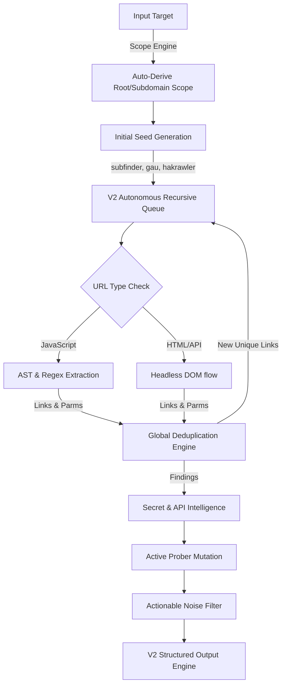

# JSEye v3.1.0 - Fully Autonomous Bug Hunting & Attack Surface Engine

<div align="center">
  
  
  
</div>

JSEye v3.1.0 represents a massive architectural leap from passive reconnaissance to **fully autonomous, intelligent bug hunting**. Designed specifically for elite offensive security engineers, JSEye natively executes infinite-depth recursion, dynamic parameter fuzzing, and mathematically deduplicated crawling—requiring **zero configuration files**.

Just point it at a target, and JSEye builds the entire attack surface.

---

## ⚡ Zero-Touch Installation

Forget source downloads and configuration files. JSEye v3.1.0 is deployed exclusively as a self-contained pip package handling its own Go-toolchain compilation implicitly.

```bash
# Global pip installation
pip install jseye

# Bypass externally managed environment warnings (WSL/Kali)
pip install jseye --break-system-packages
```

*Required: Python 3.8+*

---

## 🔥 What's New in v3.1.0 (The Autonomous Upgrade)

JSEye v3.1.0 drops legacy crutches and replaces them with 8 native Python engines:

1. **Autonomous Scope Derivation Engine:** No more `scope.txt`. Give JSEye a URL, and it leverages `tldextract` to mathematically compute the root domain, mapping all internal subdomains dynamically while locking out third-party analytics trackers.
2. **Infinite Recursive Queue:** JSEye now seamlessly unspools JavaScript imports, XHR endpoints, and dynamic routing logic infinitely. It crawls until the asset landscape is exhausted.
3. **Global Deduplication Engine:** Prevents the "infinite pagination loop" crawler death. Deep URL normalization and response-body hashing guarantee discrete endpoint discovery.
4. **Active Prober Engine (`--active`):** Passive is no longer enough. JSEye actively baselines endpoints and executes safe parameter mutations to map Reflection, CORS mismatches, and Auth Bypasses.
5. **Structured Intelligence Output:** Automatically drops sorted `urls/`, `endpoints/`, `secrets/`, `requests/`, and `exports/` into a timestamped directory artifact.
6. **Dependency Confusion Analyzer:** Automatically discovers package.json files and analyzes dependencies for supply chain vulnerabilities including dependency confusion, takeover opportunities, and suspicious versions.
7. **Dynamic CVE Intelligence:** Detects library versions from JavaScript files and queries free CVE databases (OSV, NVD) for known vulnerabilities with severity classification.
8. **Comprehensive API Detection:** Identifies 50+ API patterns including REST, GraphQL, Authentication, Admin panels, and internal APIs with automatic classification.

---

## 🧠 Core Capabilities

- **Zero-Touch Tool Orchestration**: Transparently multiplexes `subfinder`, `katana`, `gau`, `waybackurls`, `hakrawler`, and `mantra` asynchronously.
- **Deep JS AST Analysis**: Employs headless browser rendering and AST parsing to extract dynamically loaded parameters and endpoints that defeat standard static regex.
- **Swagger / OpenAPI Mapping**: Scans over 200+ known endpoints and dynamically parses OpenAPI/Swagger specifications (v2/v3).
- **Advanced Secret Contextualization**: Not just regex matching—identifies if a leaked AWS key is dynamically inserted into an `Authorization` header during async runtime.
- **Vulnerability & CVE Mapping**: Identifies obsolete library versions mapping them dynamically to NVD/OSV.
- **Dependency Confusion Detection**: Discovers package.json files and analyzes dependencies for supply chain attacks including private packages in public registries, missing packages (takeover opportunities), and suspicious version patterns.
- **Intelligent Noise Filtering**: Context-aware engine filters out metrics/analytics noise, focusing only on high-value, actionable assets.

---

## 🎯 Advanced Bug Hunter Scenarios

JSEye thrives on the CLI. It's built for rapid, chained terminal workflows.

### The Ultimate Hunter Scan
Execute the full unconstrained, autonomous recursive crawl including active parameter mutation probing:
```bash
jseye https://target.com --all --active
```

### Depth & Request Constraint Limits
Running on a constrained VDP? Cap the internal recursion depth and maximum HTTP baseline requests:
```bash
jseye https://target.com --max-depth 5 --max-requests 500
```

### Direct Asset Hunting (Skip Enum)
Already have your target locked and don't want JSEye looking for lateral subdomains? Bypass `subfinder` entirely:
```bash
jseye https://target.com --no-subs
```

### Actionable Stealth Mode
Focus only on high-fidelity, exploitable findings (removes 95% of standard framework noise) and drop outputs silently into a pipeline directory:
```bash
jseye https://target.com --actionable --aggressive-filter --silent -o /tmp/target_intel
```

### Continuous Infrastructure Diffing (CI/CD)
Compare a fresh scan against a baseline JSON report to spot newly added endpoints, shadow APIs, or leaked secrets in real-time. Powerful in cron jobs:
```bash
jseye https://target.com --compare previous_report.json --json --silent
```

### Exporting Tactical Artifacts
JSEye translates findings directly into weaponized formats for your secondary toolchain:
```bash
# Generate a Nuclei template for custom fuzzing
jseye https://target.com --export-nuclei custom_nuclei.yaml

# Generate ffuf commands perfectly tailored to the discovered parameters
jseye https://target.com --export-ffuf ffuf_commands.sh

# Export a Burp Suite sitemap for localized manual API testing
jseye https://target.com --export-burp sitemap.xml
```

---

## 🏗️ The V2 Architecture Pipeline

JSEye executes a tightly controlled, infinite-loop BFS queue architecture:


```mermaid
graph TD
    A[Input Target] -->|Scope Engine| B[Auto-Derive Root/Subdomain Scope]
    B --> C[Initial Seed Generation]
    C -->|subfinder, gau, hakrawler| D[V2 Autonomous Recursive Queue]
    D --> E{URL Type Check}
    E -->|JavaScript| F[AST & Regex Extraction]
    E -->|HTML/API| G[Headless DOM flow]
    F -->|Links & Parms| H[Global Deduplication Engine]
    G -->|Links & Parms| H
    H -->|New Unique Links| D
    H -->|Findings| I[Secret & API Intelligence]
    I --> J[Active Prober Mutation]
    J --> K[Actionable Noise Filter]
    K --> L[V2 Structured Output Engine]
```

---

## 🔐 Dependency Confusion & Supply Chain Attack Detection

JSEye v3.1.0 includes a comprehensive dependency analyzer that automatically discovers and analyzes package.json files to identify supply chain vulnerabilities.

### What It Detects

1. **Dependency Confusion Attacks**
   - Private packages (@scoped, -internal, -private) that exist in public NPM registry
   - Risk: Attackers can publish malicious packages with same name to public registry
   - Severity: CRITICAL

2. **Package Takeover Opportunities**
   - Dependencies that don't exist in NPM registry
   - Risk: Abandoned or typo'd packages can be registered by attackers
   - Severity: HIGH

3. **Suspicious Version Patterns**
   - Development versions (0.0.x, -dev, -alpha, -beta, -rc)
   - Risk: Unstable or test packages in production
   - Severity: MEDIUM

4. **Typosquatting Detection**
   - Similar package names that might be malicious clones
   - Uses fuzzy matching to identify potential typosquatting
   - Severity: MEDIUM

### How It Works

The analyzer automatically:
- Discovers package.json, package-lock.json, yarn.lock, pnpm-lock.yaml files
- Extracts all dependencies (dependencies, devDependencies, peerDependencies, optionalDependencies)
- Checks each package against NPM public registry
- Identifies private packages using pattern matching
- Calculates risk scores (0-100) with severity levels
- Reports top vulnerable dependencies with actionable insights

### Example Output

```
[Phase 7.8] Dependency Confusion Analysis
  Total Dependencies: 127
  Vulnerable Packages: 8
  Critical: 2 | High: 3 | Medium: 3
  Confusion Risk: 2 packages
  Missing Packages: 3 packages
  
  Top Vulnerable Dependencies:
  1. @company/internal-api (CRITICAL - Risk: 85)
     - Private package exists in public NPM registry
     - Dependency confusion attack vector
  
  2. legacy-auth-lib (HIGH - Risk: 65)
     - Package not found in NPM registry
     - Takeover opportunity
  
  3. react-utils-dev (MEDIUM - Risk: 45)
     - Suspicious version: 0.0.1-dev
```

### Integration with Exports

Dependency confusion findings are automatically included in all export formats:
- **Wordlist**: Vulnerable package names for further investigation
- **JSON Report**: Complete vulnerability analysis with risk scores
- **HTML Report**: Visual dashboard with severity breakdown
- **Nuclei Template**: Custom templates for dependency testing
- **Curl Commands**: API calls to verify package existence

---

## 🛠️ Local Development & Build Execution

For developers customizing the intelligence engines natively, JSEye includes automated scripts to construct and install editable pip distributions cleanly.

```bash
# Windows (PowerShell)
.\build.ps1

# Linux / macOS (Bash)
./build.sh
```

These wrappers securely clean legacy artifacts, upgrade your Python build layer, compile the wheel, and force-install the native binary into your path.

---

## 🤝 Contribution & License

Contributions are welcome! JSEye is actively maintained to map the modern JavaScript threat landscape.

This project is licensed under the **MIT License**.
